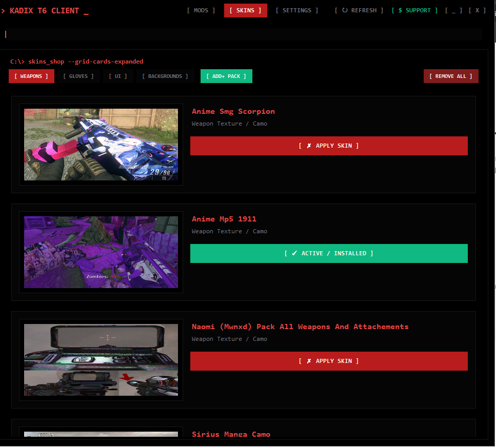
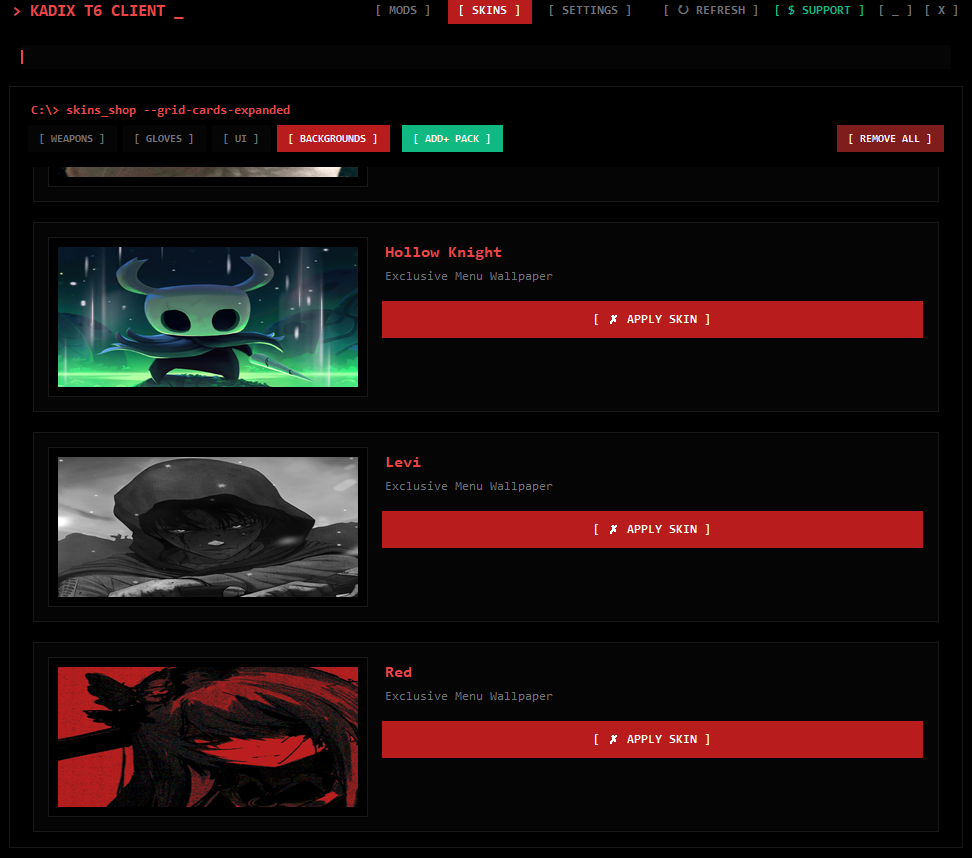
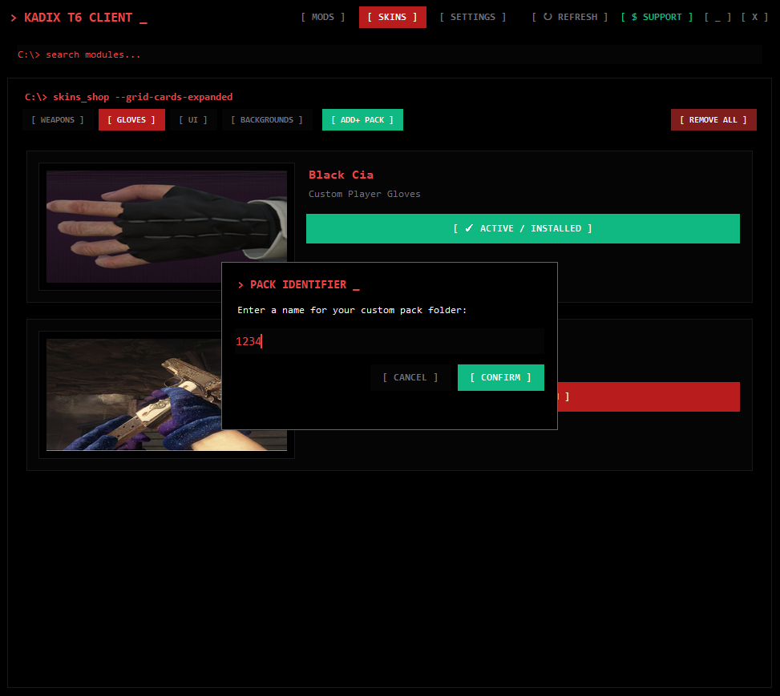

- TO DOWNLOAD OPEN DOWNLOAD FOLDER FROM HERE

**Kadix T6 Client** is a custom-built Python desktop application designed to fast managing/ installing, and toggling custom weapon textures and custom UI packs for Plutonium zombie Black Ops 2
 
 
 

-  **You can add your own packs , iwi files**
- 

**Interactive Skins Libary Grid**: Browse and manage weapon textures, anime camos, and custom attachments through an organized card grid interface (--grid-cards-expanded).

**Instant Toggle System**: Easily switch between [ ✓ ACTIVE / INSTALLED ] and custom applied states for individual asset packs.

**Category Tabs**: Filter your mods quickly with dedicated layout sections for Weapons, Gloves, UI, and Backgrounds.

**Custom Pack Management**: Import new texture packs directly using the [ ADD+ PACK ] utility or clean out configurations instantly with [ REMOVE ALL ].

**System Utilities**: Built-in top navigation bar providing quick access to mods, skins, settings, refresh commands, and app support options.

**Built For**
Plutonium T6 (Black Ops 2 Multiplayer & Zombies)

Custom desktop companion app for managing client-side modifications seamlessly.
- **virustotal scan** (https://www.virustotal.com/gui/file/2f1ad8380cb282ca6fb288da149cad2c06a6e1d0c0aa1e2ac041da0175410ccc/detection)

- **HOW TO USE**
==================================================
KADIX T6 CLIENT - SETUP GUIDE & TROUBLESHOOTING
==================================================

1. INSTALLATION:
- Run "setup.exe" and follow the on-screen installation steps.
- The installer will automatically place the application files and 
  configure your desktop/start menu shortcuts.

2. LINKING YOUR GAME DIRECTORY:
- When you first open Kadix T6 Client, it will prompt you to select 
  your Black Ops 2 game folder.
- Make sure to select the base directory where your game files 
  (t6mp.exe / t6zm.exe) are located[cite: 1].

3. PLUTONIUM STORAGE PATHS:
If you ever need to verify where the app deploys your textures (.iwi) 
and scripts (.gsc), they go directly into your Plutonium storage directory:
- Images / Camos: %localappdata%\Plutonium\storage\t6\images[cite: 1]
- Scripts & Mods:  %localappdata%\Plutonium\storage\t6\scripts[cite: 1]

4. TROUBLESHOOTING:
- If the application cannot find the Plutonium image or script folder 
  automatically, you have to create it manually. Navigate to 
  "%localappdata%\Plutonium\storage\t6\" and manually create folders 
  named "images" and "scripts" so the app can deploy files correctly[cite: 1].
- If backgrounds or assets fail to load, ensure "background.mp4" 
  and "icon.ico" were included properly during installation[cite: 1].
- Run the installer as Administrator if you encounter permission errors 
  when writing files to your AppData directory[cite: 1].
